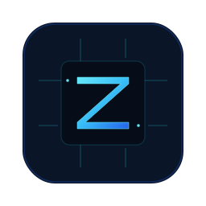

<p align="center">
  
</p>

<h1 align="center">ZenAI</h1>

<p align="center">
  App web de chat para interactuar con modelos de IA desde una interfaz clara, moderna y escalable.
</p>

## Qué es

ZenAI es una aplicación web enfocada en una experiencia de chat clara: UI rápida, temas visuales, autenticación con Firebase y un backend serverless que protege las API keys de los proveedores.

## Stack

- **Frontend**: React + TypeScript + Vite
- **Auth / Data**: Firebase (Auth + Firestore)
- **Backend**: serverless (`api/*`)
- **Providers LLM**: Groq / Cerebras

## Estructura del repo (alto nivel)

```text
api/   # endpoints serverless
docs/  # documentación general
src/   # frontend
```

## Desarrollo local

Requisitos: Node.js + npm.

1) Instala las dependencias:

```bash
npm install
```

2) Variables de entorno:

- Usa `.env.example` como base.
- Configura tus `VITE_FIREBASE_*` (frontend).
- Configura `VITE_CHAT_API_URL` si corresponde.

3) Inicia el frontend:

```bash
npm run dev
```

4) (Opcional) Inicia el backend serverless en local:

```bash
npm run dev:backend
```

## Variables de entorno (resumen)

Frontend:
- `VITE_FIREBASE_*`
- `VITE_CHAT_API_URL`

Backend (deploy):
- `GROQ_API_KEY` / `CEREBRAS_API_KEY`
- `FIREBASE_SERVICE_ACCOUNT_JSON`
